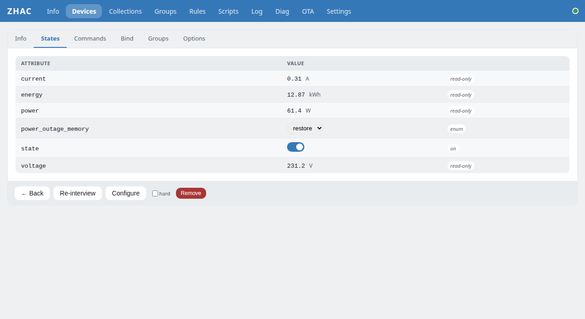
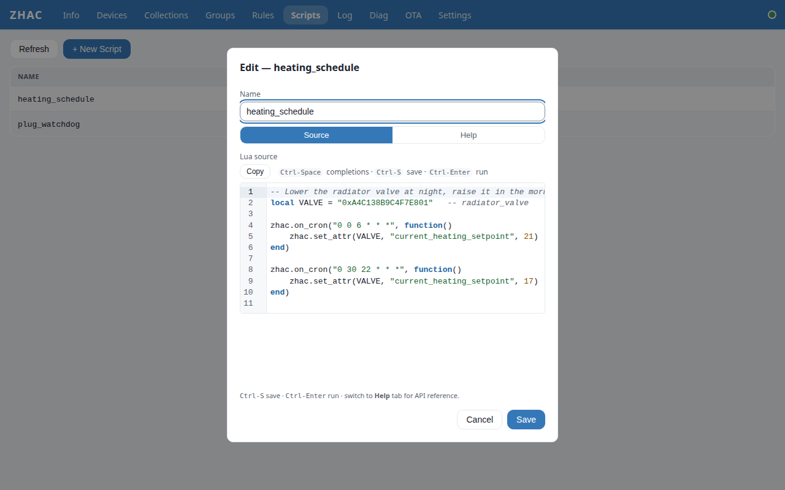

# www-spa

The web UI of [ZHAC], served by the hub itself. Preact 10 + Vite 8, one WebSocket
(`/ws`) plus a handful of REST calls. The same bundle runs on every ZHAC firmware — the
dual-chip ESP32-S3, the single-chip ESP32-S3 and the wired ESP32-P4/S31 boards — and
hides what a given build cannot do.

[ZHAC]: https://github.com/zhac-project/zhac-platform

| Devices | Device detail | Lua editor |
|---|---|---|
|  |  |  |

*Screenshots are taken against the demo hub (`npm run demo`), not real hardware.*

## Pages

- **Devices** — the paired devices, "Add a device" (guided pairing; permit join with a chosen time under Advanced), rename / re-interview / remove.
- **Device detail** — Info, States (live values, writable ones as controls), Commands,
  Bind, Groups (native Zigbee groups) and Options tabs.
- **Collections** — gateway-side groups: one command fans out to several devices.
- **Groups** — native Zigbee groups across all devices.
- **Rules** — `ON … DO … ENDON` automations: a Recipe tab (pick the sensor, the light, the time; preview; test the action) and the DSL editor with inline help.
- **Scripts** — Lua scripts in a CodeMirror editor with ZHAC-aware autocomplete.
- **Log**, **Diag** — the hub's log ring and frames no definition handled.
- **Info**, **OTA**, **Settings** — system status, firmware update, network / MQTT /
  Zigbee / access settings.
- **Sign-in** — shown when the hub has authentication on; on first boot it asks you to
  choose the admin password.

Light, dark and system themes; the layout works down to phone width.

## Development

No hardware needed — the demo hub answers the same commands as a wired hub, with six
realistic devices:

```bash
git clone https://github.com/zhac-project/www-spa.git
cd www-spa
npm ci
npm run demo         # terminal 1: fake hub on localhost:8080
npm run dev          # terminal 2: Vite on localhost:5173, /ws + /api proxied to :8080
```

Against a real hub instead, change the proxy target in `vite.config.js` to its address.

## Build for flashing

```bash
npm run build        # output in dist/
```

The firmware packs `dist/` into a SPIFFS partition. `zhac-net-core` packs its own
submodule copy; `zhac-wired-core` packs this checkout. `idf.py build` never runs `npm`,
so build here first.

## Tree

```
www-spa/
├── src/
│   ├── pages/           (12 pages, 1 file per page)
│   ├── components/      (shared UI primitives)
│   ├── editor/          (CodeMirror theme, autocomplete, linter)
│   ├── stores/          (@preact/signals state containers)
│   ├── ws/              (WS client + envelope/reply matching)
│   ├── main.jsx
│   └── styles.css
├── public/
├── tools/
│   ├── gen-zhac-completions.js  (parses LUA_API.md → completions)
│   ├── check-tokens.mjs         (design-token guard, runs before every build)
│   └── demo-server.mjs          (fake hub for development and screenshots)
├── package.json
├── vite.config.js
└── index.html
```

## Protocol

WebSocket for everything except the auth probe (`GET /api/status`,
`GET /api/devices`), sign-in and first-boot password (`/api/auth/*`) and
Lua-script upload (`POST /api/scripts/:name`, which exceeds the httpd WS
frame cap).
Request/reply envelope:
```
client → { id, cmd, args }
server → { id, ok, data }   (success)
server → { id, ok: false, err: { code, msg } }   (error)
```

Push events (no `id`): `device.added`, `device.updated`,
`device.removed`, `attr.bulk`, `alert.*`.

See [`WS_API.md`](https://github.com/zhac-project/zhac-docs/blob/master/WS_API.md)
in the zhac-docs repo for the full command list.

## Routing

Hash-based, no router library. URLs look like `#/devices`,
`#/device/<ieee>`, `#/settings`, etc. The `hashchange` listener in
`stores/ui.js` keeps the `ui.activePage` signal and the URL in sync, so
back/forward, manual hash edits, and bookmarks all replay the right
page. `navigate(page, { ieee })` updates `location.hash`; the
re-entrant hashchange path then commits the signal.

## Environment variables

| Variable        | Used by                       | Purpose                                                   |
|-----------------|-------------------------------|-----------------------------------------------------------|
| `ZHAC_LUA_DOC`  | `tools/gen-zhac-completions`  | Absolute path to `LUA_API.md`. Overrides auto-discovery.  |

If `LUA_API.md` cannot be located, the generator emits an empty
completions module and prints a warning instead of failing the build —
fresh checkouts without a sibling `zhac-docs/` clone still build.

## Content Security Policy

The SPA does NOT ship a `<meta http-equiv="Content-Security-Policy">`
because a meta-tag CSP cannot cover WebSocket (`connect-src` for the
`ws://` / `wss://` data path) on Chromium. CSP MUST be emitted by the
firmware's httpd as a response header on `/` and `/assets/*`. Recommended
minimum:

```
Content-Security-Policy:
    default-src 'self';
    connect-src 'self' ws: wss:;
    script-src  'self';
    style-src   'self' 'unsafe-inline';
    img-src     'self' data:;
    base-uri    'none';
    frame-ancestors 'none';
```

`'unsafe-inline'` is required by CodeMirror 6's inline style injection
and cannot currently be tightened without forking CM. Everything user-
authored (rule names, Lua source, log messages) is rendered via JSX text
nodes — there is no `dangerouslySetInnerHTML` anywhere in `src/`.

## Not yet

- i18n. All strings are hardcoded English. Deferred — wire-up requires
  picking an i18n approach and adding extraction tooling.

## License

GNU AGPL v3 or later. See `LICENSE`.

## Contributing

See `CONTRIBUTING.md`. All contributions require signing `CLA.md`.

## Versioning

Releases tagged `vYYYYMMDDVV`. See `zhac-platform` README for the
scheme.
